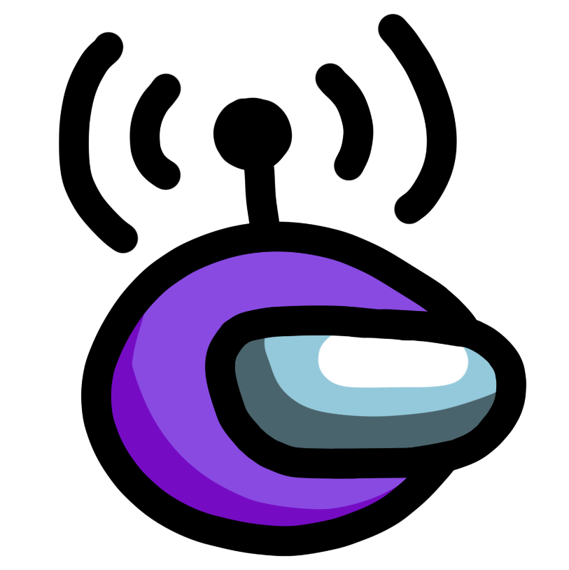

[![GPL-3.0 License][license-shield]][license-url] [![Appveyor Build][appveyor-shield]][appveyor-url] [![Donate][paypal-shield]](paypal-url)

<br />
<p align="center">
  <a href="https://github.com/ottomated/CrewLink">
    
  </a>
  <h3 align="center">BetterCrewLink a Crewlink fork with extra features & better support</h3>


  <p align="center">
    Free, open, Among Us proximity voice chat.
    <br />
    <a href="https://github.com/OhMyGuus/CrewLink/issues">Report Bug</a>
    ·
    <a href="https://github.com/OhMyGuus/CrewLink/issues">Request Feature</a>
    ·
    <a href="#installation"><b>INSTALLATION INSTRUCTIONS</b></a>
  </p>
  <p align="center">
    <b><a href="https://www.paypal.com/donate?hosted_button_id=KS43BDTGN76JQ">DONATE TO BETTERCREWLINK</a></b></br>
  (all donations will be used for the apple developer license and extra servers)</br>
   <b><a href="https://paypal.me/ottomated">Donate to ottomated (offical crewlink)</a></b>
  </p>
</p>
<hr />

<p>
  
<b>Notes:</b><br />

 - For issues with this fork u can message me on discord (ThaGuus#2140) and I will do
   my best to resolve it.
  -  To get the most of BetterCrewLink use the voice server`http://bettercrewl.ink`

</p>
<a href="https://discord.gg/qDqTzvj4SH">  </a>


<!-- TABLE OF CONTENTS -->
## Table of Contents

* [Extra features in this fork](#extra-features-in-this-fork)
* [About the Project](#about-the-project)
* [Installation](#installation)
* [Development](#development)
  * [Prerequisites](#prerequisites)
  * [Setup](#setup)
* [Contributing](#contributing)
* [License](#license)

<!-- EXTRA FEATURES-->
## Extra features/fixes in this fork
```
- Volume sliders
- It doesn't break when someone leaves/disconnects
- It works on any network even with upnp disabled (Strict NAT)
- More fun settings like hearing through cameras 
- You can actually disable the overlay
- 32bit support, windows 7 support
- U can change the volume of alive players after u died. 
- U can set bettercrewlink to topmost
- Settings actually sync between players and not half. 
- CPU usage is lower than original Crewlink. 
- U can actually press the mute key/deafen key while clicked on Bettercrewlink 
- Your mouse doesn't start to lagg because of the buggy input hook. 
- Changing the speaker setting does actually something unlike original crewlink where it is always using the default output. 
- compatible with Crewlink 2.0 
- Microphone echo cancellation 
- Microphone noise suppression. 
- more overlay positions and you can set the overlay to the top/bottom and you can set it so it shows everyone even when they aren't talking
- You can set the lobby up so only death people can talk (normal lobbies but then with death talk)

- Support for mobile (BETA)
```
***If I missed something u can dm me it so I can add it ***

<!-- ABOUT THE PROJECT -->
## About The Project

This project implements proximity voice chat in Among Us. Everyone in an Among Us lobby with this program running will be able to communicate over voice in-game, with no third-party programs required. Spatial audio ensures that you can only hear people close to you.

## Installation

Download the latest version from [releases](https://github.com/OhMyGuus/CrewLink/releases) and run the `BetterCrewLink-Setup-X.X.X.exe` file. You may get antivirus warnings, because this program hooks into the Among Us process to read game data.

If you can, you should use a private server by deploying [this repository](https://github.com/OhMyGuus/BetterCrewLink-server).

### Setup Instructions (click)

[](https://www.youtube.com/watch?v=_8F4f5iQEIc "CrewLink Setup Instructions")

## Development

You only need to follow the below instructions if you are trying to modify this software. Otherwise, please download the latest version from the [github releases](https://github.com/OhMyGuus/CrewLink/releases).

Server code is located at [OhMyGuus/BetterCrewLink-server](https://github.com/OhMyGuus/BetterCrewLink-server). Please use a local server for development purposes.

### Prerequisites

This is an example of how to list things you need to use the software and how to install them.
* [Python](https://www.python.org/downloads/)
* [node.js](https://nodejs.org/en/download/)
* yarn
```sh
npm install yarn -g
```

### Setup

1. Clone the repo
```sh
git clone https://github.com/OhMyGuus/BetterCrewLink.git
cd CrewLink
```
2. Install NPM packages
```sh
yarn install
```
3. Run the project
```JS
yarn dev
```

<!-- CONTRIBUTING -->
## Contributing

Any contributions you make are greatly appreciated.

1. Fork the Project
2. Create your Feature Branch (`git checkout -b feature/AmazingFeature`)
3. Commit your Changes (`git commit -m 'Add some AmazingFeature'`)
4. Push to the Branch (`git push origin feature/AmazingFeature`)
5. Open a Pull Request


## License

Distributed under the GNU General Public License v3.0. See `LICENSE` for more information.


[license-shield]: https://img.shields.io/github/license/OhMyGuus/BetterCrewLink.svg?style=flat-square
[license-url]: https://github.com/OhMyGuus/BetterCrewLink/blob/master/LICENSE
[appveyor-shield]: https://img.shields.io/appveyor/build/OhMyGuus/bettercrewlink
[appveyor-url]: https://ci.appveyor.com/project/OhMyGuus/bettercrewlink
[paypal-url]: https://www.paypal.com/donate?hosted_button_id=KS43BDTGN76JQ
[paypal-shield]: https://img.shields.io/badge/Donate-PayPal-green.svg
